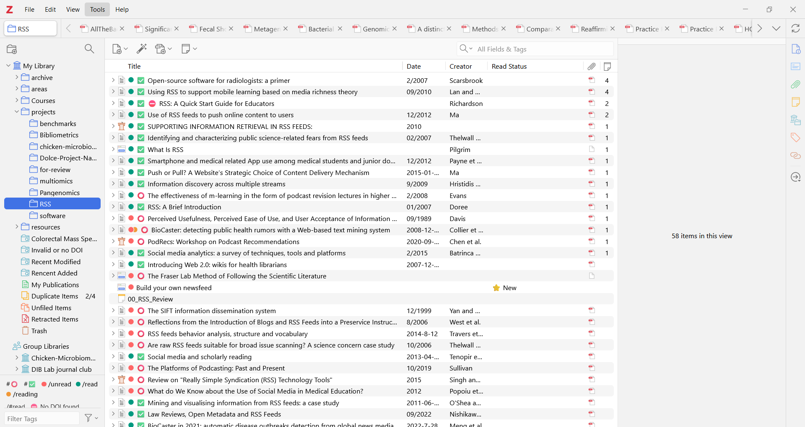
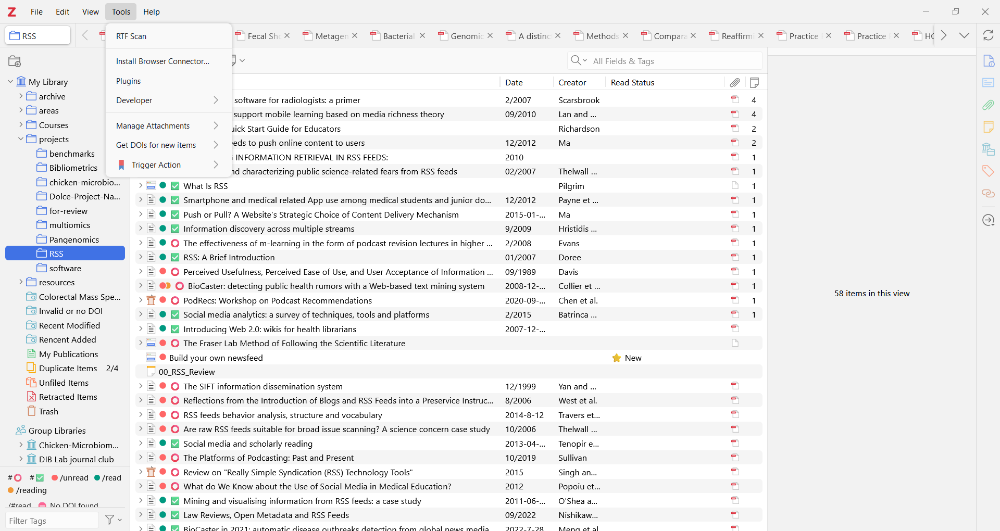

<!-- For 2026-2027: this lecture takes only 1.5h -->

## Disclaimer {.smaller}
These materials are generated by [Gerko Vink](https://www.gerkovink.com/), who used to coordinate this course and holds the copyright. 
Gerko owes a debt of gratitude to many people as the thoughts and code in these slides are the process of years-long development cycles and discussions with his team, friends, colleagues and peers. When someone has contributed to the content of the slides, he has credited their authorship.

The intellectual property belongs to Utrecht University. Images are either directly linked, or generated with StableDiffusion or DALL-E. That said, there is no information in this presentation that exceeds legal use of copyright materials in academic settings, or that should not be part of the public domain. 

::: {.callout-warning}
You **may use** any and all content in this presentation - **excluding names** - and submit it as input to generative AI tools, with the following **exception**:

- You must ensure that the content is not used for further training of the model
:::

Open Source:

- [mlarpis.github.io/markup](https://mlarpis.github.io/markup) & [github.com/mlarpis/markup](https://github.com/mlarpis/markup)

## Today's lecture

-   Markdown
-   Structure
-   Text
-   Tables & figures
-   Code & output
-   References

## Take aways

-   Quarto markdown is tool to integrate text, figures, code and output
-   Quarto enables data scientists/statisticians to communicate (re)productively
-   There is a universe of plugins and add-ons to make your academic life easier

# Markdown basics

## What is Markdown?

**Markdown** is a lightweight markup language for creating formatted text using plain text. It's easy to learn and widely used in various applications.


::: .footer
Markdown Guide. (n.d.). Retrieved September 22, 2026, from https://www.markdownguide.org/getting-started/
:::

## Markdown basics

Markdown is not [WYSIWYG](https://en.wikipedia.org/wiki/WYSIWYG).

Instead, plain text with markup instructions (e.g. `*italics*`)

are converted to marked up text (e.g. *italics*).

## Some Markdown flavors

-   **GitHub-Flavored Markdown (GFM)** is a variant of Markdown used on [GitHub](https://github.com) (next week), enhancing its capabilities for documentation and collaboration.

-   **Jupyter Notebooks**: Widely used interactive kernel-based computing environment for data science and machine learning, supporting multiple (i.e. almost all) programming and scripting languages.

-   **RMarkdown**: An R-based notebook environment that allows you to embed `R` code and its output directly within a document; combining code, output, and narrative text in a single document.

-   **Quarto**: Next generation markdown for R, Python, Julia, etc. Perfect for creating reproducible reports, research papers, and presentations.


## Using Markdown in an IDE

Popular [IDEs](https://en.wikipedia.org/wiki/Integrated_development_environment) for R:

-   **RStudio**: Ideal for R programming with features tailored for data analysis and visualization.
-   **Positron**/**Visual Studio Code (VS Code)**: A versatile code editor with a vast ecosystem of extensions for various languages.
-   **Eclipse (with StatET)**: Eclipse StatET is an integrated development environment (IDE) for R, offering features for R programming and data analysis.

## RStudio

{width="70%"}

<!-- ## `RStudio` - Integrated Development Environment (IDE) for `R` -->

<!-- -   **RStudio** is a powerful integrated development environment (IDE) designed specifically for the R programming language. -->

<!-- -   It offers a user-friendly interface and a suite of tools to enhance your R coding experience. -->

<!-- . . . -->

<!-- Key Features of RStudio -->

<!-- -   **1. Code Editing**: RStudio provides a code editor with syntax highlighting, autocompletion, and error checking, making your coding process more efficient. -->

<!-- -   **2. Console**: An interactive R console allows you to execute `R` code line by line and view results in real time. -->

<!-- -   **3. Environment Pane**: Keep track of your variables, data frames, and functions with the environment pane. -->

<!-- -   **4. Plots and Visualizations**: Create and view plots, charts, and visualizations within RStudio. -->

<!-- -   **5. Integrated Help**: Access `R` documentation, packages, and online resources directly from the IDE. -->

<!-- -   **6. Version Control**: Easily integrate `R` projects with version control systems like Git. -->

<!-- -   **7. Markdown Support**: RStudio seamlessly integrates with Markdown, making it an ideal choice for creating reproducible reports and documents. -->

<!-- It plays a crucial role in promoting reproducibility and collaboration in data science and statistical analysis. -->


## Structure of a Quarto Document

-   A Quarto document is organized into **blocks**, which serve as the fundamental building blocks of the document's content.
-   Each block can contain a combination of the following elements:
    -   **YAML Headers**: Metadata and document configuration.
    -   **Sections and Subsections**: Structuring the document into hierarchical sections for organization.
    -   **Text**: Narrative content and explanations.
    -   **Equations**: Mathematical equations and notation.
    -   **Figures**: Visualizations, charts, and images.
    -   **Tables**: Data tables for presenting results.
    -   **Code**: R code chunks for computations and data analysis.

## Quarto: the YAML header

**YAML (YAML Ain't Markup Language)** is a human-readable data serialization format commonly used for configuration files and metadata in various programming and markup contexts.

-   YAML is very simple and readable

-   In `Quarto` and many other applications, YAML is used to specify:

    -   **Document Metadata**: Information about the document itself, such as the title, author, date, and document type.

    -   **Document Configuration**: Settings related to the document's behavior, appearance, and rendering, such as the output format (e.g., HTML, PDF), document template, and style options.

    -   **Custom Variables**: Definitions of custom variables or parameters that can be used throughout the document to control behavior or content.

Here's an example of a simple YAML header in a Quarto document:

``` yaml
---
title: "A minimum example of YAML code"
---
```

## Quarto: the YAML header

-   `title`, `author`, and `date` provide metadata about the document.
-   `output` specifies settings related to the document's output format and theme.

. . . 

The YAML header is a powerful tool for customizing and configuring Quarto documents, allowing you to control how the document is rendered and presented. It ensures that important document information and settings are stored in a human-readable and structured format at the beginning of the document.

``` yaml
---
title: "All flavors markdown"
author: 
  - name: Gerko Vink
    orcid: 0000-0001-9767-1924
    email: g.vink@uu.nl
    affiliations:
      - name: Methodology & Statistics @ UU University
  - name: Hanne Oberman
    orcid: 0000-0003-3276-2141
    email: h.i.oberman@uu.nl
    affiliations:
      - name: Methodology & Statistics @ UU
date: 25 Sep 2024
date-format: "D MMM YYYY"
bibliography: data/lec-2/publications.bib
execute: 
  echo: true
editor: source
format: 
  revealjs:
    embed-resources: true
    theme: [solarized, gerko.scss]
    progress: true
    multiplex: true
    transition: fade
    slide-number: true
    margin: 0.075
    logo: "images/logo.png" 
    toc: false
    toc-depth: 1
    toc-title: Outline
    scrollable: true
    reference-location: margin
    footer: Gerko Vink and Hanne Oberman - Markup Languages @ UU
---
```

## Text in `Quarto`

Text is text. Nothing more, nothing less

### Header

#### Subheader

##### Subsubheader

``` markdown
# This is a heading indicating a section
## This is a heading indicating a subsection
### This is a heading indicating a subsubsection
```

But in the above I used

``` markdown
### Header
#### Subheader
##### Subsubheader
```

<br>

Why?

# A single \# denotes a section in slides

## A double \## denotes a slide

It is that simple. No more framing in $\LaTeX$ or other stuff. Just use the `#` and `##` to denote a section and a slide.

## Equations

-   `$\mu$` is used for in-line equations
-   `$$\mu$$` is used for equations

. . . 

:::: {.columns}

::: {.column width="45%"}

Plain text:

```
Let's assume that $Y$ follows a normal distribution. 

$$Y \sim  \mathcal{N}(\mu, \sigma^2)$$ 

Where we set in our simulations $\mu = 10$ and $\sigma^2 = 5$. We do something for every $Y_i$.
```
:::

::: {.column width="10%"}

:::

::: {.column width="45%"}

Marked up text:

Let's assume that $Y$ follows a normal distribution. $$Y \sim  \mathcal{N}(\mu, \sigma^2)$$ Where we set in our simulations $\mu = 10$ and $\sigma^2 = 5$. We do something for every $Y_i$.

:::

::::

## Equations {.nonincremental}


:::: {.columns}

::: {.column width="45%"}

Plain text:

```
Let's assume that $y$ is a vector with $n$ elements such that

$$y \sim  \mathcal{N}(\mu, \sigma^2),$$ 

where we set in our simulations $\mu = 10$ and $\sigma^2 = 5$. 

We do something for every $y_i$ with $i = 1, \dots, n$.
```
:::

::: {.column width="10%"}

:::

::: {.column width="45%"}

Marked up text:

Let's assume that $y$ is a vector with $n$ elements such that $$y \sim  \mathcal{N}(\mu, \sigma^2),$$ where we set in our simulations $\mu = 10$ and $\sigma^2 = 5$. We do something for every $y_i$ with $i = 1, \dots, n$.

:::

::::

## Hyperlinks

:::: {.columns}

::: {.column width="45%"}

Plain text:

```
Add a hyperlink to the Quarto documentation website, 
showing the URL directly 
<https://quarto.org/> 
or with 
[a description](https://quarto.org/).
```
:::

::: {.column width="10%"}

:::

::: {.column width="45%"}

Marked up text:

Add a hyperlink to the Quarto documentation website, 
showing the URL directly 
<https://quarto.org/> 
or with 
[a description](https://quarto.org/).
:::

::::

## Images

:::: {.columns}

::: {.column width="45%"}

Plain text:

```
Add an image from the internet 

```
:::

::: {.column width="10%"}

:::

::: {.column width="45%"}

Marked up text:

Add an image from the internet 

:::

::::

## Images

:::: {.columns}

::: {.column width="45%"}

Plain text:

```
Add an image from your PC

```
:::

::: {.column width="10%"}

:::

::: {.column width="45%"}

Marked up text:

Add an image from your PC

:::

::::

## Images

:::: {.columns}

::: {.column width="45%"}

Plain text:

```
Generate an image with code
```

\`\`\`{r}

```
plot(1:10)
```

\`\`\`

:::

::: {.column width="10%"}

:::

::: {.column width="45%"}

Marked up text:

Generate an image with code

```{r}
plot(1:10)
```

:::

::::

## Diagrams

```{{{mermaid}}}
%%| echo: false
flowchart LR
  A[Hard edge] --> B(Round edge)
  B --> C{Decision}
  C <--> D[Result one]
  C --> E[Result two]
```

<br>

```{mermaid}
%%| echo: false
flowchart LR
  A[Hard edge] --> B(Round edge)
  B --> C{Decision}
  C <--> D[Result one]
  C --> E[Result two]
```

See [Quarto Diagrams](https://quarto.org/docs/authoring/diagrams.html) for a more comprehensive overview of all graphing engines. This [Live online Mermaid editor](https://mermaid.live/) is awesome!

## Interactive figures

```{r, fig.width=3, fig.height=1}
```

```{r, fig.width=15, fig.height=4}
library(dygraphs)
dygraph(nhtemp, main = "New Haven Temperatures", ylab = "Temp (F)") 
```

## Interactive figures

```{r, fig.width=6, fig.height=2.5}
```

```{r, fig.width=6, fig.height=2.5}
library(dygraphs)
dygraph(nhtemp, main = "New Haven Temperatures", ylab = "Temp (F)") 
```

## Interactive figures

```{r}
library(ggplot2, warn.conflicts = FALSE)
library(plotly, warn.conflicts = FALSE)
ggplot(mpg, aes(displ, hwy, colour = class)) +
  geom_point() +
  geom_smooth(se = FALSE, method = lm) 
```

## Interactive figures

```{r message=FALSE}
library(ggplot2, warn.conflicts = FALSE)
library(plotly, warn.conflicts = FALSE)
p <- ggplot(mpg, aes(displ, hwy, colour = class)) +
  geom_point() +
  geom_smooth(se = FALSE, method = lm) 
ggplotly(p)
```

## Tables

Use `tibble`s (or `gt`) for static tables:

```{r}
mice::boys |> 
  tibble::as_tibble()
```

Or use <https://www.tablesgenerator.com/markdown_tables> if you want to manually edit a static table.

## Tables

Use `library(DT)` for interactive tables and customization:

```{r}
library(DT)
mtcars |> 
  datatable(options = list(pageLength = 25))
```

## Cross-referencing


:::: {.columns}

::: {.column width="45%"}

Plain text:

\`\`\`{r}

```
#| label: fig-one
#| fig-cap: Nonsense graph

plot(1:10)
```

\`\`\`

```
Used inline as @fig-one.
```

:::

::: {.column width="10%"}

:::

::: {.column width="45%"}

Marked up text:

```{r}
#| label: fig-one
#| fig-cap: Nonsense graph
plot(1:10)
```

Used inline as @fig-one.

:::

::::

## Cross-referencing


:::: {.columns}

::: {.column width="45%"}

Plain text:

\`\`\`{r}

```
#| label: tbl-penguins
#| tbl-cap: Penguins data
#| echo: false

gtsummary::tbl_summary(penguins)
```

\`\`\`

```
Used inline as @tbl-penguins.
```

:::

::: {.column width="10%"}

:::

::: {.column width="45%"}

Marked up text:

```{r}
#| label: tbl-penguins
#| tbl-cap: Penguins data
#| echo: false

gtsummary::tbl_summary(penguins)
```

Used inline as @tbl-penguins.

:::

::::

# Referencing

## Citing literature


:::: {.columns}

::: {.column width="45%"}

Plain text:

```
Use inline citations @ref.
```

:::

::: {.column width="10%"}

:::

::: {.column width="45%"}

Marked up text:

Use inline citations @ref.

:::

::::

. . . 

<br>

References require a bibliography entry, such as in a `.bib` file:

```
@book{ref,
  title     = {Name of the book},
  author    = {Lastname, Firstname},
  year      = {2026}
}
```

## Bibliography files

BibTeX is the classic bibliography system for LaTeX. It stores references in a `.bib` file, links them by citation keys, and formats output with a selected bibliography style.

The `.bib` file's role is to store bibliographic records, and only entries that have been cited* will appear in the reference list.


\* e.g., via `\cite{...}` in `.tex` files, or  `@...` in Quarto

## Reference management software

-   What *is* RMS?
    -   Database of bibliographic records
    -   Creator of bibliographic citations
    -   Document and knowledge management
        -   Collection structure
        -   Tags
        -   Notetaking

::: fragment
> Zotero \[zoh-TAIR-oh\] is a free, easy-to-use tool to help you collect, organize, cite, and share your research sources. - [Zotero's quick start guide](https://www.zotero.org/support/quick_start_guide){target="_blank"}
:::

## Install & setup Zotero

::: {.columns}

:::: {.column}

1. Go to [zotero.org](https://www.zotero.org/)

::::

:::: {.column}

[{.lightbox}]{fig-align="right"}

::::

:::

## Create a web account {data-menu-title="Web account creation: Step 2"}

<!-- ## Install & Setup -->

::: {.columns}

:::: {.column}

::::: {.nonincremental}

1. [Go to [zotero.org](https://www.zotero.org/)]{.op}
2. Click `Log In`

:::::

::::

:::: {.column}

[{.lightbox}]{fig-align="right"}

::::

:::

## Create a web account {data-menu-title="Web account creation: Step 3"}

<!-- ## Install & Setup -->

::: {.columns}

:::: {.column}

::::: {.nonincremental}

1. [Go to [zotero.org](https://www.zotero.org/)]{.op}
2. [Click `Log In`]{.op}
3. Click `Register for a free account`

:::::

::::

:::: {.column}

[{.lightbox}]{fig-align="right"}

::::

:::

## Create a web account {data-menu-title="Web account creation: Step 4"}

<!-- ## Install & Setup -->

::: {.columns}

:::: {.column}

::::: {.nonincremental}

1. [Go to [zotero.org](https://www.zotero.org/)]{.op}
2. [Click `Log In`]{.op}
3. [Click `Register for a free account`]{.op}
4. Fill out the info

:::::

::::

:::: {.column}

[{.lightbox}]{fig-align="right"}

::::

:::

## Create a web account {data-menu-title="Web account creation: Step 5"}

<!-- ## Install & Setup -->

::: {.columns}

:::: {.column}

::::: {.nonincremental}

1. [Go to [zotero.org](https://www.zotero.org/)]{.op}
2. [Click `Log In`]{.op}
3. [Click `Register for a free account`]{.op}
4. [Fill out the info]{.op}
5. Click `Register`

:::::

::::

:::: {.column}

[{.lightbox}]{fig-align="right"}

::::

:::

## Download Zotero for your Operating System

<!-- ## Install & Setup -->

At [zotero.org/download](https://www.zotero.org/download/)

::: {.columns}

:::: {.column width="40%"}

#### Details

::::: {.fragment}

:::::: {.nonincremental}

-   Mac
-   Windows
-   Linux
-   [Chromebook](https://www.zotero.org/support/kb/installing_on_a_chromebook)
-   [Automatically updates]{.hovertext data-hover="May manually install over existing version without data loss" style="--hover-width: 250px;"}

::::::

:::::

::::

:::: {.column width="60%"}

{.lightbox}

::::

:::

## [Zotero Connector in browser simplifies storing articles]{.small}

<!-- ## Install & Setup -->

::: notes
https://forums.zotero.org/discussion/76073/solved-zotero-connector-shortcut-conflict-with-firefox
:::

At [zotero.org/download](https://www.zotero.org/download/)

::: {.columns}

:::: {.column width="40%"}

#### Details

::::: {.fragment}

:::::: {.nonincremental}

-   Firefox (Recommended)
-   Chrome
-   Edge
-   Safari

::::::

:::::

::::

:::: {.column width="60%"}

{.lightbox}

::::

:::

## Optionally: download the app

<!-- ## Install & Setup -->

- Benefits
  - Portability
  - interoperability
  - Gathering and managing on the go
    -   `Share` $\rightarrow$ `Zotero app`
    
. . . 

[Click your operating system below:]{.fragment}

```{=html}
<style>
.badge-container {
    display: flex;
    flex-wrap: wrap;
    gap: 16px;
    justify-content: center;
    align-items: center;
}

.badge-container .badge {
    flex: 1;
    max-width: 200px;
    text-align: center;
}

.badge-container .badge img {
    height: 100px;
    width: auto;
    border-radius: 8px;
    transition: transform 0.2s ease;
}

.badge-container .badge img:hover {
    transform: scale(1.25);
}
</style>

<div class="badge-container">

  <div class="badge">
    <a href="https://play.google.com/store/apps/details?id=com.mickstarify.zooforzotero" target="_blank">
      
    </a>
  </div>
  
  <div class="badge">
    <a href="https://apps.apple.com/us/app/zotero/id1513554812" target="_blank">
      
    </a>
  </div>

</div>
```

## [Downloading plugins to extend Zotero's abilities]{.small}

<!-- ## Install & Setup -->

-   Download the `.xpi` file for the version you want
    -   For Firefox, right-click and `Save Link As...`
        -   OR! Set the `Boolean` for `browser.altClickSave` to true at `about:config`

::: {.nonincremental}
:::: {.columns}
::::: {.column width="50%"}

:::::: {.incremental}

-   [Actions and Tags](https://github.com/windingwind/zotero-actions-tags#actions-and-tags-for-zotero){target="_blank"}
    -   [Latest Release](https://github.com/windingwind/zotero-actions-tags/releases/latest){target="_blank"}

::::::

:::::

::::: {.column width="50%"}

:::::: {.incremental}

-   [ZotMoov](https://github.com/wileyyugioh/zotmoov#zotmoov){target="_blank"}
    -   [Latest Release](https://github.com/wileyyugioh/zotmoov/releases/latest){target="_blank"}

::::::

:::::

::::

:::

## [Install plugins to complete Zotero's extenstion]{.small} {data-menu-title="Installing plugins: Step 1"}

<!-- ### Install & Setup -->

::: {.columns}

:::: {.column width="45%"}

::::: {.small}

:::::: {.nonincremental}

1.  Open Zotero

::::::

:::::

::::

:::: {.column width="55%"}

{.lightbox}
::::

:::

## [Install plugins to complete Zotero's extenstion]{.small} {data-menu-title="Installing plugins: Step 2"}

<!-- ### Install & Setup -->

::: {.columns}

:::: {.column width="45%"}

::::: {.small}

:::::: {.nonincremental}

1.  [Open Zotero]{.op}
2.  Select `Tools` $\rightarrow$ `Plugins`

::::::

:::::

::::

:::: {.column width="55%"}

{.lightbox}

::::

:::

## [Install plugins to complete Zotero's extenstion]{.small} {data-menu-title="Installing plugins: Step 3"}

<!-- ### Install & Setup -->

::: {.columns}

:::: {.column width="45%"}

::::: {.small}

:::::: {.nonincremental}

1.  [Open Zotero]{.op}
2.  [Select `Tools` $\rightarrow$ `Plugins`]{.op}
3.  Select the gear (⚙️) in the top-right corner


::::::

:::::

::::

:::: {.column width="55%"}

{.lightbox}

::::

:::

## [Install plugins to complete Zotero's extenstion]{.small} {data-menu-title="Installing plugins: Step 4"}

<!-- ### Install & Setup -->

::: {.columns}

:::: {.column width="45%"}

::::: {.small}

:::::: {.nonincremental}

1.  [Open Zotero]{.op}
2.  [Select `Tools` $\rightarrow$ `Plugins`]{.op}
3.  [Select the gear (⚙️) in the top-right corner]{.op}
4.  Choose `Install Plugins From File…`

::::::

:::::

::::

:::: {.column width="55%"}

{.lightbox}

::::

:::

## [Install plugins to complete Zotero's extenstion]{.small} {data-menu-title="Installing plugins: Step 5-8"}

<!-- ### Install & Setup -->

::: {.columns}

:::: {.column width="45%"}

::::: {.small}

:::::: {.nonincremental}

1.  [Open Zotero]{.op}
2.  [Select `Tools` $\rightarrow$ `Plugins`]{.op}
3.  [Select the gear (⚙️) in the top-right corner]{.op}
4.  [Choose `Install Plugins From File…`]{.op}
5.  Choose `.xpi` files to install
6.  Select `Open`
7.  Select `Install`
8.  Restart Zotero

::::::

:::::

::::

:::: {.column width="55%"}


::::

:::

<!-- [Take a few minutes to make sure everything is set up]{.fragment .absolute bottom=0} -->

```{r}
#| echo: false
countdown::countdown(minutes = 5, seconds = 0, warn_when = 120, 
                     right = "0%", top = "10%",
                     blink_colon = TRUE, id = "special_timer")
```

## Plugins

Download and install Zotero plugins (as `.xpi` files) to get:

- More informative and editable citation keys with 
[Better BibTeX for Zotero](https://retorque.re/zotero-better-bibtex/citing/index.html)
- Retraction notices with [Retraction Watch integration](https://www.zotero.org/blog/retracted-item-notifications/) 
- Citation info with [Scite](https://scite.ai/blog/introducing-the-scite-plug-in-for-zotero-61189d66120c)
- [etc.](https://www.zotero.org/support/plugins)

## Citations

```         
## Citations

@eval and Cai, Van Buuren and Vink [-@cai2023graphical] are some of our team's most recent publications. Some references - such as some work by Reinder Banning and Gerko Vink are much older [-@banningvink] or contain simple and contemporary solutions by @vigntg [p. 2-4] or cool but potentially confusing images [@schouten2021dance, 1255].

::: footer
But you can also refer to @eval here
:::

::: {#refs}
:::
```

@eval and Cai, Van Buuren and Vink [-@cai2023graphical] are some of our team's most recent publications. Some references - such as some work by Reinder Banning and Gerko Vink are much older [-@banningvink] or contain simple and contemporary solutions by @vigntg [p. 2-4] or cool but potentially confusing images [@schouten2021dance, 1255].

::: footer
But you can also refer to @eval here
:::

::: {#refs}
:::

<br>

# Putting it all together

## Image placement

::::: columns
::: {.column width="40%"}
{fig-align="left"}

The above figure is left-aligned <br> The caption is also left-aligned
:::

::: {.column width="20%"}

:::

::: {.column width="40%"}
{fig-align="center"}

The above figure is centered <br> The caption is still left-aligned
:::
:::::

The code for the figures is

``` markdown
{fig-align="left"}
{fig-align="center"}
```

## Columns, sizing, equations and proper centering

::::: columns
::: {.column width="50%"}
{fig-align="left" width="80%"}

$e^{i\pi} + 1 = 0$

The above figure is left-aligned <br> The caption is also left-aligned <br> The equation is left-aligned too
:::

::: {.column width="50%"}
<center>

{fig-align="center" width="80%"}

</center>

$$e^{i\pi} + 1 = 0$$

The above figure is centered <br> The caption is also centered <br> The equation is centered
:::
:::::

The code for the slide is

``` markdown
## Columns, Sizing, Equations and proper centering

::: columns
::: {.column width="50%"}
{fig-align="left" width="80%"}

$e^{i\pi} + 1 = 0$

The above figure is left-aligned <br>
The caption is also left-aligned <br>
The equation is left-aligned too
:::

::: {.column width="50%"}
<center>
{fig-align="center" width="80%"}
</center>

$$e^{i\pi} + 1 = 0$$

The above figure is centered <br>
The caption is also centered <br>
The equation is centered
:::

:::

The code for the slide is

``` markdown
## Columns, Sizing, Equations and proper centering

::: columns
::: {.column width="50%"}
{fig-align="left" width="80%"}

$e^{i\pi} + 1 = 0$

The above figure is left-aligned <br>
The caption is also left-aligned <br>
The equation is left-aligned too
:::

::: {.column width="50%"}
<center>
{fig-align="center" width="80%"}
</center>

$$e^{i\pi} + 1 = 0$$

The above figure is centered <br>
The caption is also centered <br>
The equation is centered
:::

:::
```

## F-ing it all up

::::: columns
::: {.column width="70%"}
{fig-align="left" width="70%"}

$e^{i\pi} + 1 = 0$

The above figure is left-aligned <br> The caption is also left-aligned <br> The equation is left-aligned too
:::

::: {.column width="30%"}
<center>

{fig-align="center" width="30%"}

</center>

$$e^{i\pi} + 1 = 0$$

The above figure is centered <br> The caption is also centered <br> The equation is centered
:::
:::::

``` markup
::: columns
::: {.column width="70%"}
{fig-align="left" width="70%"}

$e^{i\pi} + 1 = 0$

:::

::: {.column width="30%"}
<center>
{fig-align="center" width="30%"}
</center>

$$e^{i\pi} + 1 = 0$$
:::

:::
```

## Math-ing it all up

::::: columns
::: {.column width="70%"}
{fig-align="left" width="30%"}

$e^{i\pi} + 1 = 0$
:::

::: {.column width="30%"}
<center>

{fig-align="center" width="70%"}

</center>

$$e^{i\pi} + 1 = 0$$
:::
:::::

``` markup
## Math-ing it all up
::: columns
::: {.column width="70%"}
{fig-align="left" width="30%"}

$e^{i\pi} + 1 = 0$
:::

::: {.column width="30%"}
<center>
{fig-align="center" width="70%"}
</center>

$$e^{i\pi} + 1 = 0$$
:::

:::
```

```         

```markdown
END OF EXAMPLE
```


## Code chunks

```{r}
#| echo: false

answer <- 12 * 234
```

We already saw some `markdown` code chunks. We can run inline code to calculate that `12 * 234` is `r answer` by using `` `r ` `` and code chunks to evaluate larger blocks of code, such as:

```{r}
#| label: fig-mpg2
#| fig-cap: "City and highway mileage for 38 popular models of cars."
#| fig-subcap:
#|   - "Color by number of cylinders"
#|   - "Color by engine displacement, in liters"
#| layout-ncol: 2
#| column: page
#| code-fold: true
library(ggplot2)

ggplot(mpg, aes(x = hwy, y = cty, color = cyl)) +
  geom_point(alpha = 0.5, size = 2) +
  scale_color_viridis_c() +
  theme_minimal()

ggplot(mpg, aes(x = hwy, y = cty, color = displ)) +
  geom_point(alpha = 0.5, size = 2) +
  scale_color_viridis_c(option = "E") +
  theme_minimal()
```

## The previous slide

````         
## Code chunks and explicit caching

```{{r}}
#| output: asis

answer <- 12 * 234
``` 
````

```{=html}
<div class="sourceCode">
<pre class="sourceCode markdown">
<code class="sourceCode markdown">
We already saw some `markdown` code chunks. We can run inline code to calculate 
that `12 * 234` is &#96; r answer &#96; by using &#96;r  &#96; and code chunks to evaluate 
larger blocks of code, such as:
</code>
</pre>
</div>
```

```{{{r}}}
#| output: asis
#| label: fig-mpg
#| fig-cap: "City and highway mileage for 38 popular models of cars."
#| fig-subcap:
#|   - "Color by number of cylinders"
#|   - "Color by engine displacement, in liters"
#| layout-ncol: 2
#| column: page
#| code-fold: true
library(ggplot2)

ggplot(mpg, aes(x = hwy, y = cty, color = cyl)) +
  geom_point(alpha = 0.5, size = 2) +
  scale_color_viridis_c() +
  theme_minimal()

ggplot(mpg, aes(x = hwy, y = cty, color = displ)) +
  geom_point(alpha = 0.5, size = 2) +
  scale_color_viridis_c(option = "E") +
  theme_minimal()
```

## Explicit Caching

-   **Explicit caching** is a technique used in RMarkdown and Quarto documents to store and reuse the results of expensive computations or data processing steps.
-   It helps improve the efficiency of document generation and ensures reproducibility by avoiding redundant calculations. <br>

. . .

### Why Use Explicit Caching?

-   **Efficiency**: Caching saves time and resources by avoiding the repeated execution of time-consuming code chunks.

-   **Reproducibility**: Explicit caching ensures that the same results are used when rendering the document, even if the code is modified or re-executed.

-   **Version Control**: Caching reduces the size of version-controlled documents by storing intermediate results separately.

## How Does Explicit Caching Work?

In `RMarkdown` and `Quarto`, you can use cache directives to specify which code chunks should be cached and which should not.

-   Cached chunks are identified by a unique hash based on their code content, ensuring consistency.

The following code block

```{{r}}
#| cache: true
#| code-line-numbers: true
#| label: imputation
library(mice)
library(purrr)
imp <- nhanes |> mice(print = FALSE)
imp |>
  complete("all") |> 
  map(~lm(bmi ~ chl + hyp, data = .x)) |>
  pool()
```

would result in this output

```{r}
#| cache: true
#| code-line-numbers: true
#| label: imputation
library(mice)
library(purrr)
imp <- nhanes |> mice(print = FALSE)
imp |>
  complete("all") |> 
  map(~lm(bmi ~ chl + hyp, data = .x)) |>
  pool()
```

with corresponding cache structure relative to the root and format of the output file: 

## `reprex` and `renv`

``` r
library(renv)
#> 
#> Attaching package: 'renv'
#> The following objects are masked from 'package:stats':
#> 
#>     embed, update
#> The following objects are masked from 'package:utils':
#> 
#>     history, upgrade
#> The following objects are masked from 'package:base':
#> 
#>     autoload, load, remove
renv::init()
#> - Linking packages into the project library ... Done!
#> The following package(s) will be updated in the lockfile:
#> 
#> # CRAN -----------------------------------------------------------------------
#> - backports       [* -> 1.4.1]
#> - base64enc       [* -> 0.1-3]
#> - broom           [* -> 1.0.4]
#> - bslib           [* -> 0.4.2]
#> - cachem          [* -> 1.0.8]
#> - cli             [* -> 3.6.1]
#> - cpp11           [* -> 0.4.3]
#> - digest          [* -> 0.6.31]
#> - dplyr           [* -> 1.1.2]
#> - ellipsis        [* -> 0.3.2]
#> - evaluate        [* -> 0.21]
#> - fansi           [* -> 1.0.4]
#> - fastmap         [* -> 1.1.1]
#> - fontawesome     [* -> 0.5.1]
#> - fs              [* -> 1.6.2]
#> - generics        [* -> 0.1.3]
#> - glue            [* -> 1.6.2]
#> - highr           [* -> 0.10]
#> - htmltools       [* -> 0.5.5]
#> - jquerylib       [* -> 0.1.4]
#> - jsonlite        [* -> 1.8.4]
#> - knitr           [* -> 1.43]
#> - lattice         [* -> 0.21-8]
#> - lifecycle       [* -> 1.0.3]
#> - magrittr        [* -> 2.0.3]
#> - memoise         [* -> 2.0.1]
#> - mime            [* -> 0.12]
#> - pillar          [* -> 1.9.0]
#> - pkgconfig       [* -> 2.0.3]
#> - purrr           [* -> 1.0.1]
#> - R6              [* -> 2.5.1]
#> - rappdirs        [* -> 0.3.3]
#> - Rcpp            [* -> 1.0.11]
#> - RcppArmadillo   [* -> 0.12.4.0.0]
#> - renv            [* -> 1.0.2]
#> - rlang           [* -> 1.1.1]
#> - rmarkdown       [* -> 2.22]
#> - sass            [* -> 0.4.6]
#> - stringi         [* -> 1.7.12]
#> - stringr         [* -> 1.5.0]
#> - tibble          [* -> 3.2.1]
#> - tidyr           [* -> 1.3.0]
#> - tidyselect      [* -> 1.2.0]
#> - tinytex         [* -> 0.45]
#> - utf8            [* -> 1.2.3]
#> - vctrs           [* -> 0.6.2]
#> - withr           [* -> 2.5.0]
#> - xfun            [* -> 0.39]
#> - yaml            [* -> 2.3.7]
#> 
#> # GitHub ---------------------------------------------------------------------
#> - mice            [* -> gerkovink/mice@match_conditional]
#> 
#> The version of R recorded in the lockfile will be updated:
#> - R               [* -> 4.3.0]
#> 
#> - Lockfile written to "/private/var/folders/yx/6rn4qpl13wsgk4c7s3jc9d1r0000gp/T/RtmpMqetyA/reprex-1233f6d959b19-drear-kitty/renv.lock".
library(mice)
#> 
#> Attaching package: 'mice'
#> The following object is masked from 'package:stats':
#> 
#>     filter
#> The following objects are masked from 'package:base':
#> 
#>     cbind, rbind
library(magrittr)
library(purrr)
#> 
#> Attaching package: 'purrr'
#> The following object is masked from 'package:magrittr':
#> 
#>     set_names
#> The following object is masked from 'package:renv':
#> 
#>     modify
renv::snapshot()
#> - The lockfile is already up to date.
renv::remove("mice")
#> - Removing package(s) from project library ...
#> Removing package 'mice' ... Done!
renv::restore()
#> The following package(s) will be updated:
#> 
#> # GitHub ---------------------------------------------------------------------
#> - mice   [* -> gerkovink/mice@match_conditional]
#> 
#> # Installing packages --------------------------------------------------------
#> - Installing mice ...                           OK [linked from cache]
imp <- nhanes |> mice(print = FALSE)
imp |>
  complete("all") |> 
  map(~.x %$% lm(bmi ~ chl + hyp)) |>
  pool()
#> Class: mipo    m = 5 
#>          term m   estimate         ubar            b            t dfcom
#> 1 (Intercept) 5 20.6687887 2.020809e+01 8.8963873222 3.088375e+01    22
#> 2         chl 5  0.0354435 5.409979e-04 0.0001081414 6.707676e-04    22
#> 3         hyp 5 -0.8447582 4.353337e+00 0.9275040571 5.466342e+00    22
#>          df       riv    lambda       fmi
#> 1  9.489411 0.5282868 0.3456725 0.4504537
#> 2 14.161181 0.2398710 0.1934645 0.2874598
#> 3 13.811544 0.2556671 0.2036105 0.2983537

sessionInfo()
#> R version 4.3.0 (2023-04-21)
#> Platform: aarch64-apple-darwin20 (64-bit)
#> Running under: macOS Ventura 13.6
#> 
#> Matrix products: default
#> BLAS:   /Library/Frameworks/R.framework/Versions/4.3-arm64/Resources/lib/libRblas.0.dylib 
#> LAPACK: /Library/Frameworks/R.framework/Versions/4.3-arm64/Resources/lib/libRlapack.dylib;  LAPACK version 3.11.0
#> 
#> locale:
#> [1] en_US.UTF-8/en_US.UTF-8/en_US.UTF-8/C/en_US.UTF-8/en_US.UTF-8
#> 
#> time zone: Europe/Amsterdam
#> tzcode source: internal
#> 
#> attached base packages:
#> [1] stats     graphics  grDevices utils     datasets  methods   base     
#> 
#> other attached packages:
#> [1] purrr_1.0.1    magrittr_2.0.3 mice_3.15.3    renv_1.0.2    
#> 
#> loaded via a namespace (and not attached):
#>  [1] vctrs_0.6.2      cli_3.6.1        knitr_1.43       rlang_1.1.1     
#>  [5] xfun_0.39        generics_0.1.3   glue_1.6.2       backports_1.4.1 
#>  [9] htmltools_0.5.5  fansi_1.0.4      rmarkdown_2.22   grid_4.3.0      
#> [13] evaluate_0.21    tibble_3.2.1     fastmap_1.1.1    yaml_2.3.7      
#> [17] lifecycle_1.0.3  compiler_4.3.0   dplyr_1.1.2      fs_1.6.2        
#> [21] pkgconfig_2.0.3  Rcpp_1.0.11      tidyr_1.3.0      rstudioapi_0.14 
#> [25] lattice_0.21-8   digest_0.6.31    R6_2.5.1         tidyselect_1.2.0
#> [29] reprex_2.0.2     utf8_1.2.3       pillar_1.9.0     tools_4.3.0     
#> [33] withr_2.5.0      broom_1.0.4
```

<sup>Created on 2023-09-27 with [reprex v2.0.2](https://reprex.tidyverse.org)</sup>

## Benefits of Using `renv`

-   **1. Dependency Isolation**: `renv` creates a dedicated environment for each project, preventing conflicts between package versions.

-   **2. Reproducibility**: With `renv`, you can capture and record the specific package versions used in your project, ensuring reproducibility over time.

-   **3. Collaboration**: Share your project with others, and they can easily recreate the same environment using `renv.lock`.

-   **4. Easier Package Installation**: `renv` simplifies package installation. Just run `renv::restore()` to set up the project environment.

-   **5. Automatic Snapshot**: `renv` automatically generates a `renv.lock` file, listing all package versions used, making it easy to recreate the environment.

-   **6. Compatibility**: `renv` is compatible with popular version control systems like Git, facilitating collaboration and sharing.

. . .

Use `renv::snapshot()` to update the `renv.lock` file when you add or update packages. You can use `renv::activate()` and `renv::deactivate()` to activate or deactivate `renv` for your project.

## Scientific publishing with `rticles` and `Quarto`

To use `rticles` from `RStudio`, you can access the templates through `File -> New File -> R Markdown`. This will open the dialog box where you can select from one of the available templates:


### Quarto

The `quarto use template` command can be used to create an article from one the below formats.

``` {.bash filename="Terminal"}
quarto use template quarto-journals/acm
quarto use template quarto-journals/plos
quarto use template quarto-journals/elsevier
quarto use template quarto-journals/acs
quarto use template quarto-journals/jss
```


## Take aways

-   Quarto markdown is tool to integrate text, figures, code and output
-   Quarto enables data scientists/statisticians to communicate (re)productively
-   There is a universe of plugins and add-ons to make your academic life easier

## References
