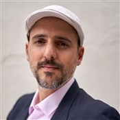
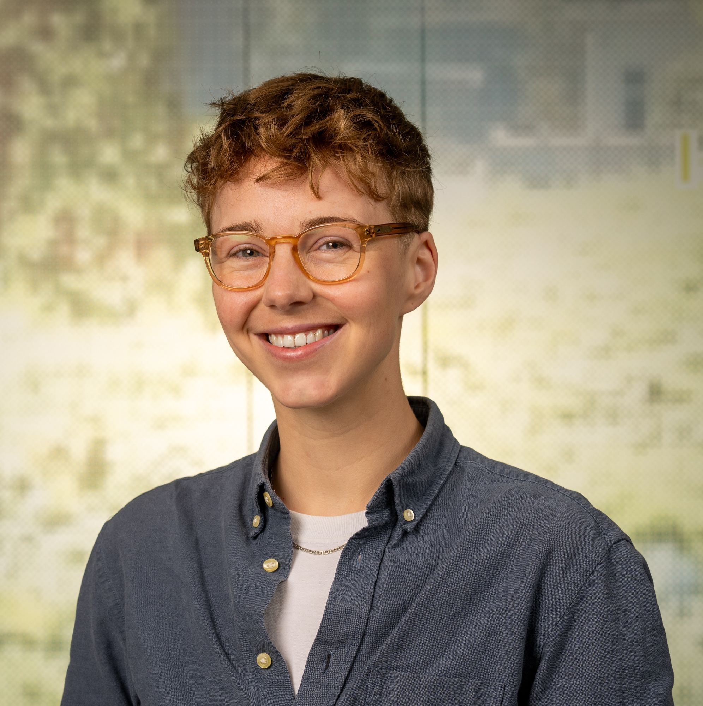

# Teaching team {.unnumbered}

## Instructors
{style="float:right;padding: 0 0 0 10px;" fig-alt="Headshot of Pablo" width="200"}

Pablo Mosteiro is an Assistant Professor and a member of the Natural Language and Text Processing group. His research focuses on [Natural Language Processing](https://en.wikipedia.org/wiki/Natural_language_processing) (NLP), specifically on [language change](https://en.wikipedia.org/wiki/Language_change) and [information-theoretic](https://en.wikipedia.org/wiki/Information_theory) approaches to [linguistics](https://en.wikipedia.org/wiki/Linguistics). He investigates the evolution of synonyms and the relationship between morphology and syntax in numerous languages worldwide. 
For a more extensive description of his research and teaching, see [his university profile](https://www.uu.nl/staff/PJMosteiroRomero).
Pablo has previously worked as an experimental particle physicist and as a commercial software developer. You can reach Pablo at [p.mosteiro\@uu.nl](mailto:p.mosteiro@uu.nl)

---

{style="float:right;padding: 0 0 0 10px;" fig-alt="Headshot of Hanne" width="200"}

Hanne Oberman is a Junior Assistant Professor and develops cool computational evaluation applications. Hanne is a key figure in Utrecht's Open Science Community and has a knack for new developments in creating and maintaining robust software. Hanne is a contributor and developer to multiple R-packages, some of which are in the top 10 packages developed at Utrecht University. Oh, and Hanne is much too polite, which is why [Gerko](https://www.gerkovink.com/) wrote this text on Hanne's behalf. You can reach Hanne at [h.i.oberman\@uu.nl](mailto:h.i.oberman@uu.nl) 
